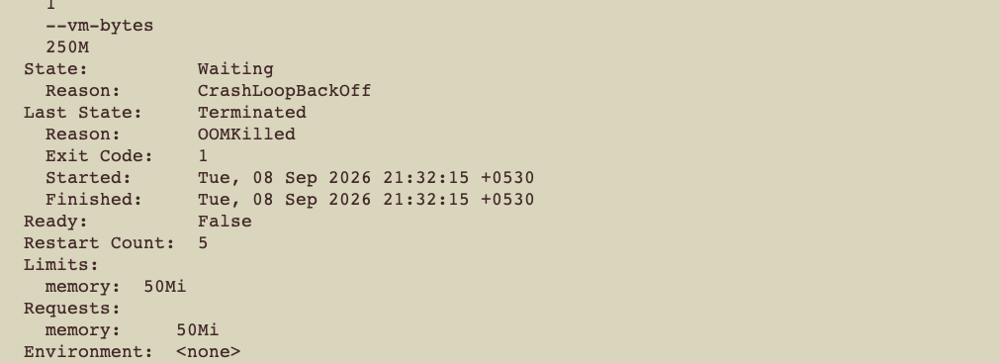

## ⚖️ Compute Quotas (Requests & Limits)



```bash
# Generate base deployment blueprint frame
kubectl create deployment resource-demo --image=nginx --dry-run=client -o yaml > deployment.yaml
```

### Resource Snippet Reference
```yaml
        resources:
          requests:
            memory: "64Mi"
            cpu: "250m"
          limits:
            memory: "128Mi"
            cpu: "500m"
```
```bash
kubectl run oom-demo --image=linux/stress --dry-run=client -o yaml > pod1.yaml
```

```yaml
apiVersion: v1
kind: Pod
metadata:
  name: oom-demo
spec:
  containers:
  - name: stress-container
    image: polinux/stress
    # 🌟 CORRECTION: "stress" must be the first item in the execution sequence
    command: ["stress"]
    args: ["--vm", "1", "--vm-bytes", "250M"]
    resources:
      limits:
        memory: "50Mi"

```