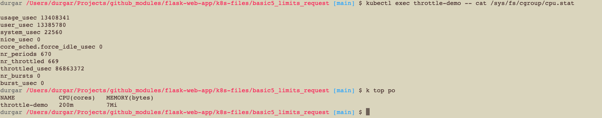

## ⚖️ Compute Quotas (Requests & Limits)


```bash
# Generate base deployment blueprint frame
kubectl create deployment resource-demo --image=nginx --dry-run=client -o yaml > deployment.yaml
```

### Resource Snippet Reference
```yaml
        resources:
          requests:
            memory: "64Mi"
            cpu: "250m"
          limits:
            memory: "128Mi"
            cpu: "500m"
```
```bash
kubectl run oom-demo --image=linux/stress --dry-run=client -o yaml > pod1.yaml
```

```yaml
apiVersion: v1
kind: Pod
metadata:
  name: oom-demo
spec:
  containers:
  - name: stress-container
    image: polinux/stress
    # 🌟 CORRECTION: "stress" must be the first item in the execution sequence
    command: ["stress"]
    args: ["--vm", "1", "--vm-bytes", "250M"]
    resources:
      limits:
        memory: "50Mi"

```

# 🏎️ Kubernetes CPU Throttling Lab Validation

This experiment proves how Kubernetes manages **compressible resources** (CPU). Unlike Memory (`OOMKilled`), breaching a CPU limit will never terminate or restart a container. Instead, the Linux kernel cgroups subsystem dynamically forces the process to sleep (throttle) to protect the host node.


## 2. Real-Time Metrics Extraction

### Metric Check (Flatlining at the Limit)
```bash
kubectl top pod
```
**Expected Output:**
The CPU metric column tracks at exactly `200m`—proving that the container is executing at max capacity but cannot cross its specified boundary.


---

## 3. Deep Linux Kernel Verification (`cgroups v2`)

Because the pod remains status `Running` with `0` restarts, we inspect the underlying Linux statistics inside the container to view the execution penalty.

```bash
kubectl exec throttle-demo -- cat /sys/fs/cgroup/cpu.stat
```

### Deciphering the Telemetry Matrix

* **`nr_periods`**: Total time tracking cycles elapsed.
* **`nr_throttled`**: The precise number of cycles where the Linux kernel forcefully intervened to freeze the application execution paths.
* **`throttled_usec`**: Cumulative time (measured in microseconds) that the application process was deliberately forced to sleep to respect the `200m` limit rule.


---

## 4. Teardown
```bash
kubectl delete pod throttle-demo --grace-period=0 --force
```
