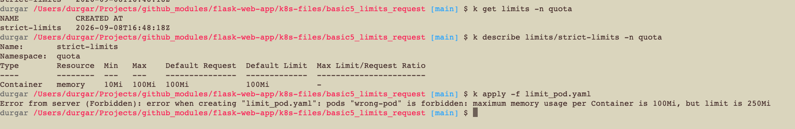

# 🛡️ Kubernetes LimitRange Policy Validation Lab

This experiment demonstrates how a cluster administrator uses a **LimitRange** at the Namespace level to enforce resource constraints. 

Unlike pod-level `resources` configuration, a `LimitRange` acts as an entry gatekeeper. Any incoming pod manifest that violates its policies is instantly rejected by the cluster's admission controllers before it can even be scheduled.

---

## 1. Environment Isolation Setup

To keep our tests clean and structured, we create a dedicated sandbox workspace:

```bash
kubectl create namespace quota
```

---

## 2. Establishing the Policy (`limit1.yaml`)

Because `kubectl create` does not feature an imperative subcommand generator for a `LimitRange`, the policy must be defined directly via raw manifest execution.

```yaml
apiVersion: v1
kind: LimitRange
metadata:
  name: strict-limits
  namespace: quota   # Scope restricted to our quota namespace
spec:
  limits:
  - max:
      memory: "100Mi"         # Hard ceiling: Containers cannot request more than this
    min:
      memory: "10Mi"          # Hard floor: Containers must request at least this much
    type: Container
```

Apply the policy constraints to the cluster:
```bash
kubectl apply -f limit1.yaml
```

---

## 3. Deploying an Illegal Workload (`illegal-pod.yaml`)

We use `kubectl run` with dry-run parameters to build a base configuration:
```bash
kubectl run illegal-pod --image=flask-app:v1 --dry-run=client -o yaml > illegal-pod.yaml
```

Open `illegal-pod.yaml` and update the container specs to deliberately request **250Mi**, crossing the **100Mi** policy threshold:

```yaml
apiVersion: v1
kind: Pod
metadata:
  name: illegal-pod
  namespace: quota-sandbox
spec:
  containers:
  - name: flask-container
    image: flask-app:v1
    resources:
      limits:
        memory: "250Mi"       # ❌ VIOLATION: Higher than the 100Mi ceiling
```

---

## 4. Live Admission Controller Interception

Attempt to apply the faulty pod layout manifest:
```bash
kubectl apply -f k8s/illegal-pod.yaml
```

### Expected Server Error Response
The cluster control plane flags the constraint failure instantly and blocks creation:

```text
Error from server (Forbidden): error when creating "k8s/illegal-pod.yaml": 
pods "illegal-pod" is forbidden: minimum memory usage per Container is 10Mi, 
but request is 0; max memory usage per Container is 100Mi, but limit is 250Mi.
```

### [ INSERT TERMINAL FORBIDDEN ERROR SCREENSHOT HERE ]

Verify that no invalid pod allocation footprint exists inside the workspace:
```bash
kubectl get pods -n quota
```
*(Result: No resources found).*

---

## 5. Teardown
```bash
kubectl delete namespace quota
```
